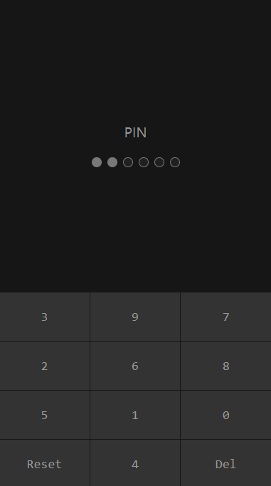

## 간편비밀번호 6자리 입력 랜덤 포지션 UI

Demo : https://kimkee.github.io/keypad/


``` js
const keypad = {
	init:function(){
		this.kset();
	},
	cnum: 0,
	pnum: 6, /* 비번갯수 */
	dset: function(n){ /* 점들 그리기 */
		const dbox = document.querySelector(".dots");
		let dot = '';
		for(let d = 0; d < this.pnum; d++){
			n > d ? ac = 'on' : ac = '';
			dot += '<em class="dt '+ac+'"></em>';
		}
		dbox.innerHTML = dot;
		if( this.cnum >= this.pnum){
			this.cnum = this.pnum;
			this.pcom();
		};
		console.log(this.cnum);
	},
	kset: function(c){ /* 번호 그리기 */
		const kbox = document.querySelector(".keys .box");
		const norg = [0, 1, 2, 3, 4, 5, 6, 7, 8, 9];
		const nums = [...norg];
		const choc = e => nums.splice( Math.floor(Math.random() * nums.length) , 1); /* 랜덤 뽑기 */
		let bts= '';
		let bn = '';
		let bx = '<button type="button" value="del" class="bt">Del</button>';
		let bc = '<button type="button" value="rst" class="bt">Reset</button>';
		for(let i of norg){
			let pp = choc();
			let bt = '<button type="button" value="' + pp + '" class="bt">' + pp + '</button>';
			console.log(i, pp, nums);
			i == 8 ? bn = bc : null;
			i == 9 ? bn = bx : null;
			bts += bt + bn;
		}
		kbox.innerHTML = bts;
		this.dset(0);
		this.cnum = 0;
		kbox.querySelectorAll(".bt").forEach( el => el.addEventListener("click", e => this.pset(el) ) );
	},
	pset: function(el){ /* 버튼클릭 */
		el.value == 'del' ? this.cnum-- : this.cnum++ ;
		el.value == 'rst' ? this.cnum = 0 : null ;
		this.cnum < 0 ? this.cnum = 0 : null;
		this.dset(this.cnum, el.value);
	},
	pcom: e => location.reload() /* 모두 입력 후 */
};
keypad.init();
```